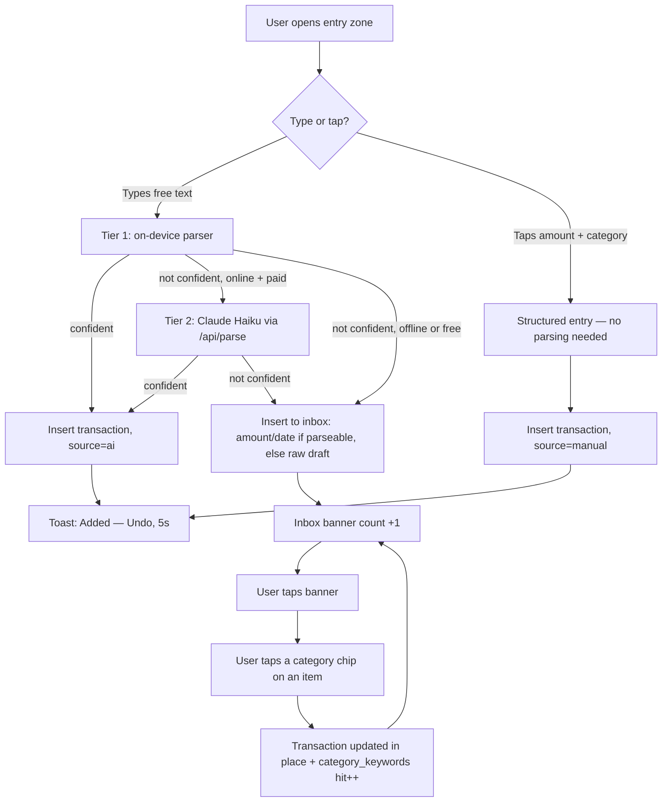

# 07 — Manual Entry UX

## Core principle: one entry zone, two ways in

MVP scope calls for a <3s manual flow and a single AI text box (doc 01). Both
live in the same on-screen entry zone rather than as separate flows/screens —
"type or tap" is one component with two paths, not two features.

## App shell: single continuous scroll, no tab bar

Home is one scrollable screen: entry zone → inbox banner (only when count >
0) → current-month budgets → one trend chart → recent transactions → "see
all" drill-in. Settings reachable via a small icon in the app bar. No bottom
tab bar in v1.

Chosen over a conventional tab bar because entry speed is the product's
stated differentiator — a single screen keeps the entry zone one thumb-reach
from everything else, and the MVP's view surface (doc 01) is small enough
that dedicated tabs for Transactions/Budgets would mostly be empty chrome
around a handful of components. Revisit if/when the full transaction list or
budgets view outgrows a drill-in.

## The entry zone: two states

**Collapsed (default)**: a single placeholder line — "type or tap what you
spent…" — so budgets, trend, and recent activity stay glanceable on first
open. Chosen over an always-expanded pad because Home's first impression is
"here's your budget," with entry one tap away, not the reverse.

**Expanded (on tap/focus)**: amount pad (numeric grid) + category chips,
ranked by frequency, below a live amount preview. Account defaults to the
last-used account, date defaults to today — neither is shown unless the user
taps to change it. Tapping a category chip both picks it and submits; there
is no separate save step. Income vs. expense is a small toggle pill
(defaults to expense, matching the parser's own default rule in doc 04).

Typing free text into the same input instead of using the pad skips straight
to the Tier 1/Tier 2 parsing pipeline (doc 04) — same box, no mode switch to
choose upfront.

**Account and currency default the same way — collapsed, not shown as chip
rows.** Both surface only as two small pills ("Visa (CAD)", "JPY") sitting
above the amount, not as open chip lists — showing the full frequency-ranked
picker (same pattern as category chips) only when a pill itself is tapped.
This was a mockup mistake worth naming: an earlier draft rendered both as
always-expanded chip rows the moment the pad opened, which contradicts the
same "hidden until touched" rule already governing account/date defaults
above. Fixed to match.

Account chips display as `institution — name` (docs/12, D60/D61) when an
account has one set — necessary, not cosmetic, once real account counts
reach into the teens (docs/12) and two different banks might reasonably
both have an account called "Checking."

Account defaults to the account of the single most recent transaction
across all accounts (a query, not a stored preference). Currency defaults
to **that account's last-used currency** — not its native currency —
derived from that account's own most recent transaction. In practice:
switching to JPY once on a trip makes every later entry on that same card
default to JPY too, without re-picking it each time. Picking a *different*
account resets the currency default back to that new account's own
currency, since the account choice itself usually implies one (e.g. picking
a BRL-denominated account already implies BRL).

## Confirmation: toast, not a screen

Every successful insert — whether from the pad or from parsing — surfaces a
brief toast ("Added — Undo", ~5s) rather than a confirmation screen. A
low-confidence parse instead reads "Added to inbox — needs a category," with
a one-tap link into the inbox. Either way the entry is never blocked or
held for review before being saved (doc 04's "ambiguity degrades to
friction, never data loss").

## The inbox

A list of low-confidence items, each still showing the raw utterance (the
user is confirming what the parser saw, not guessing blind) plus a row of
frequency-ranked category chips. Tapping a chip categorizes that item in
place — no return to a list — and feeds `category_keywords` (doc 04's
learning loop). Surfaced as a banner on Home, not a permanent nav tab: the
count should trend to zero, and a tab would misrepresent it as an ongoing
section of the app rather than a transient queue.

## Entry flow



## Layout reference

```
┌─────────────────────────────────┐
│ piggypal                    ⋯   │
├─────────────────────────────────┤
│ type or tap what you spent…     │  ← collapsed entry zone
├─────────────────────────────────┤
│ ● 3 entries need a category  ›  │  ← inbox banner, only if N>0
├─────────────────────────────────┤
│ August · Mercado (CAD) $420/$600│  ← one bar per (category, currency)
│ ████████████░░░░░                │     with budget or spend — see docs/10
│ August · Transporte   $204/$180 │
│ ██████████████████░ (over)      │
├─────────────────────────────────┤
│ Last 30 days              $1,840│
│ [ sparkline ]                    │
├─────────────────────────────────┤
│ Recent                          │
│ Mercado          −$45.00  ontem │
│ Salário        +$3,200.00  2d   │
│ Uber             −$18.40  2d    │
│              see all ›          │
└─────────────────────────────────┘
```

## Decisions locked in this doc

| # | Decision | Why |
|---|---|---|
| D22 | Single continuous scroll on Home, no bottom tab bar in v1 | Entry speed is the differentiator; MVP's view surface is too small to justify dedicated tab chrome |
| D23 | Entry zone collapsed by default; amount pad/chips expand on tap or focus | Keeps budgets/trend/recent glanceable on first open; costs one tap before entry, in exchange |
| D24 | Tapping a category chip both selects and submits — no separate save step | Matches the <3s target; confirmation happens via a toast, not a blocking screen |
| D25 | Inbox surfaced as a banner on Home (count-gated), not a permanent nav tab | The queue should trend to zero; a tab would misrepresent it as an ongoing app section |
| D26 | Inbox items keep the raw utterance visible until categorized, and categorize in place without returning to a list | User confirms what the parser saw rather than guessing blind; batch-clearing stays fast |
| D44 | Tap-entry gets a currency picker (frequency-ranked chips, same pattern as categories), collapsed to a single pill by default, not shown as an open row | Closes the gap where only the typed/AI path could set a non-default currency (doc 10) — without cluttering the common case that never touches it |
| D45 | Currency default = the selected account's *last-used* currency (from its most recent transaction), not its native currency; resets on account switch | Avoids re-picking currency on every entry during a trip, while still resetting sensibly when the account itself changes |
| D46 | Tap-entry gets an account picker too (same pattern), collapsed to a pill by default; default value = account of the single most recent transaction, no stored preference | Consistent with how currency and category chips already work; picking an account here is what resets the currency default |
| D47 | Typed/AI entry can specify account: Tier 2 matches an injected account list only on explicit mention (never guesses); Tier 1 does a cheap exact-name match only, no fuzzy/NLU | Mirrors doc 04's "never guess" rule for category_id; keeps Tier 1's capability boundary honest — deterministic matching only, no inference reserved for the LLM |
